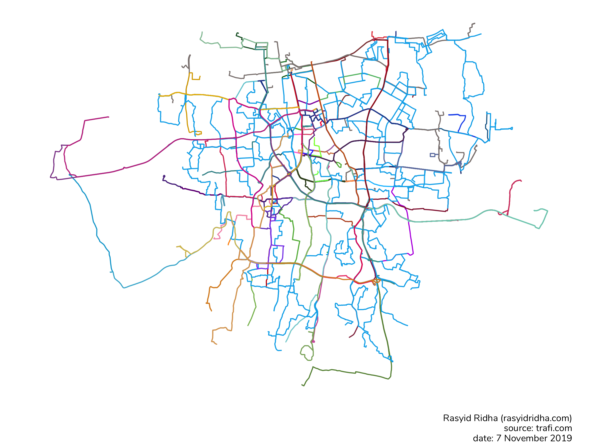
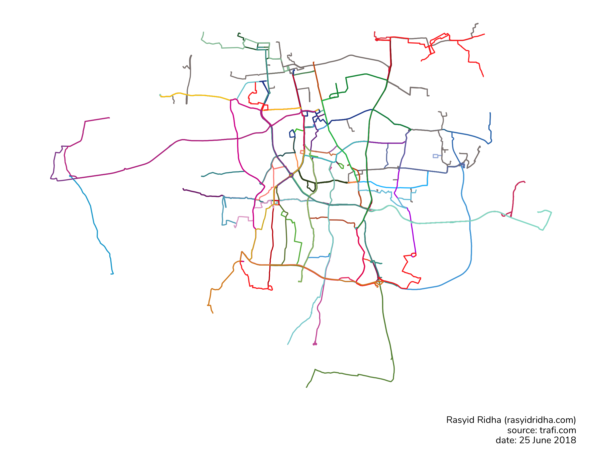

# transjakarta
Prepare and visualize Transjakarta dataset using R

* `01_get.R` get Transjakarta route data
* `01_get_realtime.R` get real-time Transjakarta GPS data
* `02_halte.R` create clean Transjakarta halte dataset from Transjakarta route data
* `02_route.R` create clean Transjakarta route dataset from Transjakarta route data
* `03_viz.R` visualize Transjakarta dataset

Post: [Visualize Transjakarta Route](http://rasyidridha.com/datakepo/rute-transjakarta/)

## 07/11/2019

## 25/06/2018

