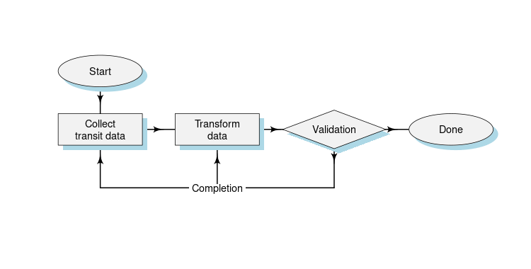
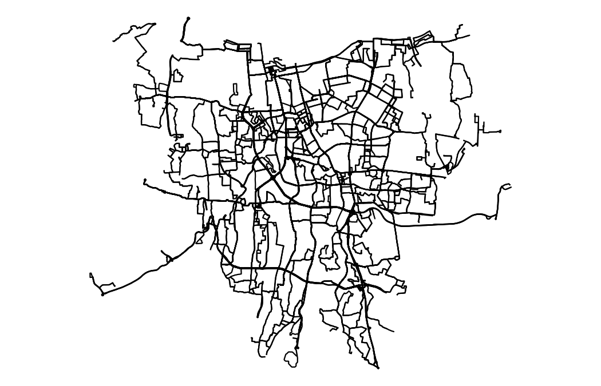

## GTFS Transjakarta

**Create Transjakarta BRT datasets using General Transit Feed Specification (GTFS) format**

The General Transit Feed Specification (GTFS) is the de facto standard for transit passenger information. GTFS allows transportation service providers to share their geographic, schedule, fare, real-time, and other data with traveler-facing applications ([MobilityData.org](https://mobilitydata.org/what-we-do/#GTFS)). The feeds let public transit agencies publish their transit data and developers write applications that consume that data in an interoperable way ([Google Transit](https://developers.google.com/transit/gtfs)).

Description about files in this repository:

-   **00_get.R** for getting Transjakarta routes and stops details
-   **00_schedule.R** for getting current schedules
-   **01\*.R** - **06\*.R** for creating GTFS formatted txt files
-   **comparison.R** for comparing routes from different data sources
-   **flow.R** for creating workflow diagram
-   **validation.R** for validate GTFS files
-   **data** directory for storing data
-   **figs** directory for images

### Todo

-   [x] ~~Add `trips.service_id` based on **calendar.txt** and data from Moovit~~
-   [x] ~~Create `stop_times.stop_sequence` with correct value (now, still placeholder data)~~
-   [ ] Need `stop_times.arrival_time` and `stop_times.departure_time`
-   [x] ~~Create one of **calendar.txt** or **calendar_dates.txt**~~
-   [ ] Fix same `trips.trip_id` (e.g. just presented as a-b and b-a)
-   [ ] Several routes are still not in true shape while imported!
-   [ ] Add a license??
-   [ ] Add **frequencies.txt** (optional, based on schedule data and **stop_times.txt**)
-   [ ] Create Github Action for pulling data schedule

### Data Sources

-   [Trafi](https://www.trafi.com/)
-   [Moovit](https://moovitapp.com/)
-   [Transjakarta](https://transjakarta.co.id)
-   [BRTData.net](https://www.brtdata.net/city?c=jakarta) (not yet)
-   [Global BRT Data](https://brtdata.org/location/asia/indonesia/jakarta) (not yet)

### Workflow

### Validation Status

GTFS validation is done using [`tidytransit`](https://github.com/r-transit/tidytransit) package can be [seen here](validation_status.csv). In the table you will see notes as below:

-   `req` : required
-   `opt` : optional
-   `TRUE` : is provided
-   `FALSE` : is missing
-   `ok` : all is well
-   `info` : look detail in the next column

### Transjakarta Route Service

### Related Project

-   [Bogor Angkot GTFS](https://github.com/michielbdejong/bogor-angkot-gtfs) by Michiel de Jong
-   Available [transit feeds](http://transitfeeds.com/l/526-indonesia) in Indonesia collected by OpenMobilityData

### References

-   [GTFS Specification](https://github.com/google/transit/blob/master/gtfs/spec/en/reference.md) by Google Transit

### Contribution

This repository was a clone project from [Rasyid Ridha](https://github.com/rasyidstat/transjakarta). For further contribution, kindly email me on [andi.herlan\@pm.me](mailto:andi.herlan@protonmail.com) or open an issue or pull request.
